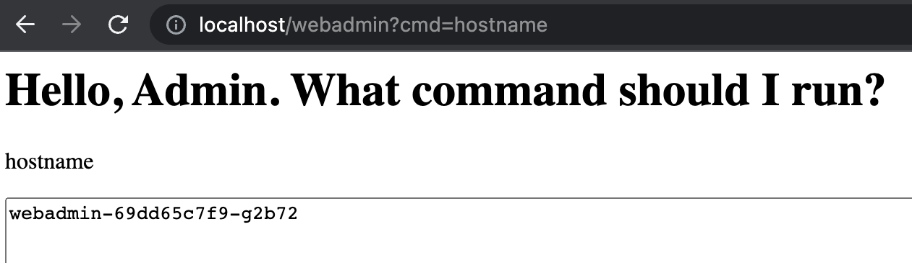
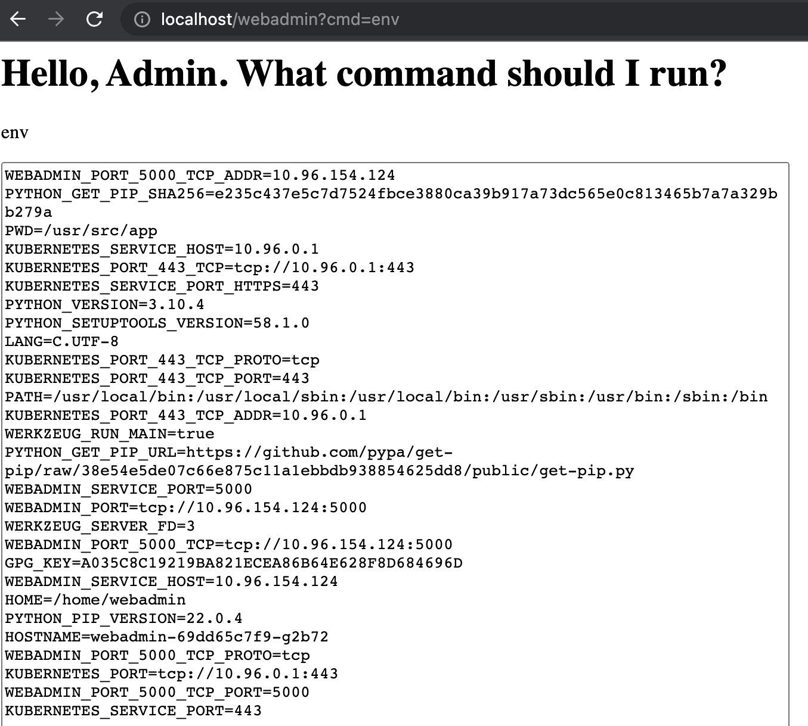
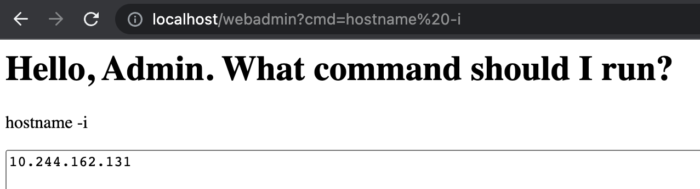
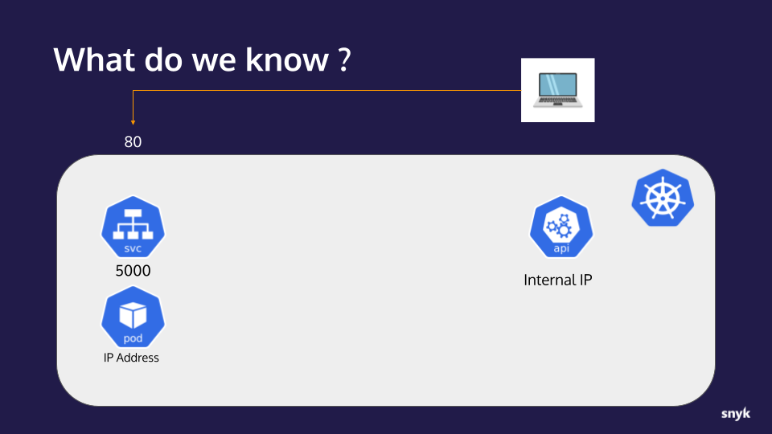
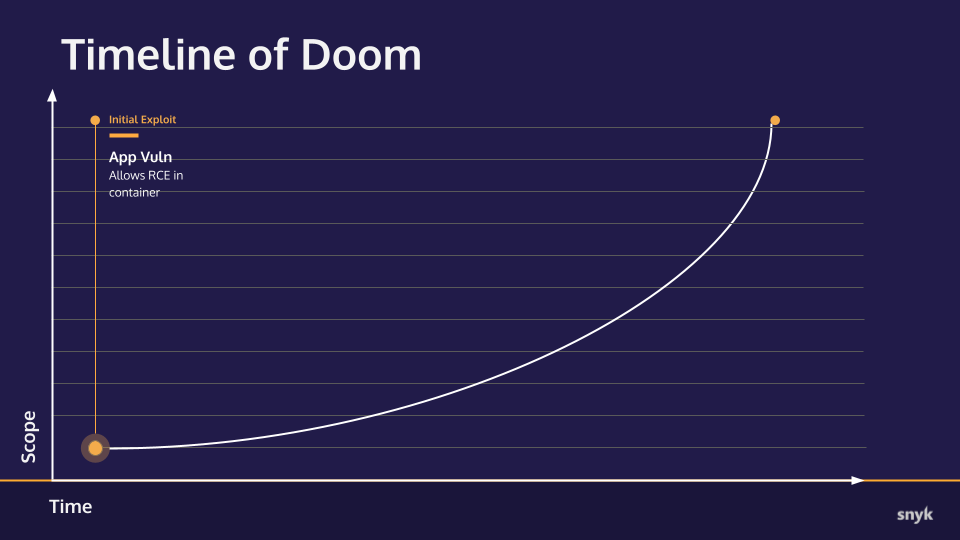

# Hands-on Hacking K8s Workshop | Section 2: Exploit Walk-through

<!-- TOC -->
* [Hands-on Hacking K8s Workshop | Section 2: Exploit Walk-through](#hands-on-hacking-k8s-workshop--section-2--exploit-walk-through)
  * [Overview](#overview)
  * [Setting the scene](#setting-the-scene)
  * [Part 1: Examining the vulnerability](#part-1--examining-the-vulnerability)
    * [Checkpoint](#checkpoint)
      * [What we now know:](#what-we-now-know-)
      * [Timeline of Doom](#timeline-of-doom)
  * [Next step](#next-step)
<!-- TOC -->

## Overview
In this workshop we're will be demonstrating how the combination of an application vulnerability and a
misconfiguration can allow an attacker to spread the blast radius of an attack on a Kubernetes cluster using common
default configurations.

This is a pattern that almost every major exploit of recent years has followed: an application vulnerability
gives an attacker the initial foothold and then application and infrastructure level misconfigurations allow
that attacker to spread in the other parts of your cluster.
---

## Setting the scene
Imagine you're a hacker, and you have found a vulnerable application on the Internet. You don't know much
else about it other than the fact that it has a particular vulnerability. For the purpose of this workshop,
the application is a mock-up that has a remote control command execution (RCE) vulnerability which is going to
allow us to run commands directly on the server that's running the web application.
This workshop uses a simple Flask app that has a simulated RCE, but these kinds of vulnerabilities do
exist in the wild such as in middleware, libraries, and container images. This kind of vulnerability
allows an attacker to pass malformed or specifically crafted HTTP requests to allow them to run commands
directly on the target server.

---
## Part 1: Examining the vulnerability

1. Open the vulnerable application in your browser at http://localhost/webadmin
   The vulnerability can be exploited by passing a `cmd` URL parameter.  For example, the
   following will execute a `hostname` command and show the console output on the returned page: http://localhost/webadmin?cmd=hostname 
   

2. Ok, that proves that our RCE is working so now let's use it to get some more interesting information. Change the `cmd` parameter
   to `env` to print out the processes' environment variables: http://localhost/webadmin?cmd=env
   
   Base on the various variable names starting with `KUBERNETES`, it's pretty safe to assume this process is running in
   a container, on a Kubernetes cluster. Also, given that the `hostname` command returned a name prefixed with `webadmin`
   the `WEBADMIN_SERVICE_PORT=5000` variable probably means there is a Kubernetes Service listening internally on port 5000
   and some kind of LoadBalancer and/or Ingress is proxying/translating our port 80 request to that port.
   Finally, the `KUBERNETES_PORT=tcp://10.96.0.1:443` variable tells me that the Kubernetes api-server internal IP address
   and port is at `10.96.0.1:443`.

3. The next bit of information we want to find out is the IP address of the pod we are running in so let's run `hostname -i`:
   http://localhost/webadmin?cmd=hostname%20-i
   

### Checkpoint
Let's take a moment to collect our notes and track our progress.

#### What we now know:
* An application with an RCE vulnerability is available to us on port 80
* The application is running in a container on a Kubernetes cluster
* The application is behind a service listening on port 5000
* The Kubernetes api-server internal IP address 
* The IP address of the container/pod the application is running in

#### Timeline of Doom
As we increase the scope of our attack, we'll update this graph showing how we are progressing toward total ownership
of the target cluster.  At this initial stage the timeline looks like this:

---
## Next step
In the [next step](02b-exploit.md), we will start poking around in attempt to access resources outside our container.
