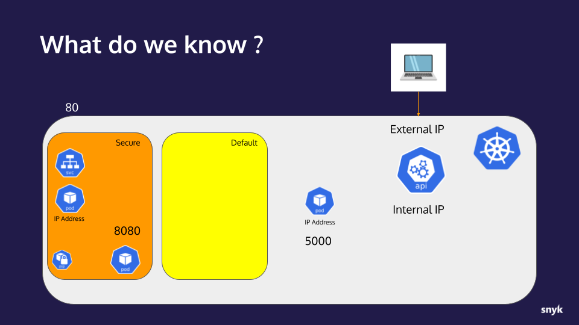

# Hands-on Hacking K8s Workshop | Section 2: Exploit Walk-through

<!-- TOC -->
* [Hands-on Hacking K8s Workshop | Section 2: Exploit Walk-through](#hands-on-hacking-k8s-workshop--section-2--exploit-walk-through)
  * [Part 5: Exploring beyond our Namespace](#part-5--exploring-beyond-our-namespace)
    * [Checkpoint](#checkpoint)
      * [What we already knew:](#what-we-already-knew-)
      * [New info:](#new-info-)
      * [Timeline of Doom](#timeline-of-doom)
  * [Next step](#next-step)
<!-- TOC -->

## Part 5: Exploring beyond our Namespace

Now that we own a container with root privileges, we will use it to explore more of the cluster and try
to find other targets.  Since we know this cluster is hosting a vulnerable application in _production_, there's a good chance
other instances of it may be running elsewhere and since it was deployed with a port 5000 service, there's
a chance that the same deployment configure might be used.

We will do this using the `nmap` tool to scan the network for other copies of this vulnerable app by looking for
anything accepting connections on port 5000.

1. First, while still exec'ed into the `snyky` Pod as `root` from the prior steps, let's find out what our Pod's IP address is.
   There are several ways to do this: `hostname -i` or `ifconfig` both will work here
   ```shell
   root@snyky:~# hostname -i
   10.244.162.137
   
   root@snyky:~# ifconfig
   eth0: flags=4163<UP,BROADCAST,RUNNING,MULTICAST>  mtu 1480
           inet 10.244.162.137  netmask 255.255.255.255  broadcast 0.0.0.0
   ...
   ```
2. Now, we'll use that IP in the `nmap` arguments to specify the Pod network: `nmap -sS -p 5000 -PN -n --open 10.244.162.137/24`
   Replace `10.244.162.137` in your command line with the IP you got above.
   ```shell
   root@snyky:~# nmap -sS -p 5000 -PN -n --open 10.244.162.137/24
   Starting Nmap 7.80 ( https://nmap.org ) at 2022-08-30 22:06 UTC
   Nmap scan report for 10.244.162.131
   Host is up (0.000050s latency).
   
   PORT     STATE SERVICE
   5000/tcp open  upnp
   
   Nmap scan report for 10.244.162.132
   Host is up (0.000022s latency).
   
   PORT     STATE SERVICE
   5000/tcp open  upnp
   
   Nmap done: 256 IP addresses (256 hosts up) scanned in 14.71 seconds
   ```
   What we see is that there are two IP addresses listening on port 5000:
   * `10.244.162.131` - That's the original Pod we attacked in the `secure` Namespace
   * `10.244.162.132` - This is something else... maybe another copy of the vulnerable application?🤔
   
   _Note: We have to be a root user this to work because nmap requires it. If you try exiting back to the `snyky`
   user, you'll find that `nmap` won't work._
   ```shell
   snyky@snyky:/root$ nmap -sS -p 5000 -PN -n --open 10.244.162.137/24
   You requested a scan type which requires root privileges.
   QUITTING!
   ```
   
### Checkpoint
Let's take a moment to collect our notes and track our progress.

#### What we already knew:
* An application with an RCE vulnerability is available to us on port 80
* The application is running in a container on a Kubernetes cluster
* The application is behind a service listening on port 5000
* The Kubernetes api-server internal IP address 
* The IP address of the container/pod the application is running in
* The ServiceAccount and Pod configurations in the `secure` Namespace is using the default `automountServiceAccountToken` setting of `true`
* Using a found ServiceAccount token, we were able to connect to the cluster's api-server
* The api-server returned Endpoint information exposing its external IP _(although our workshop Kind cluster obscures this in practice)_
* The account for the token gathered has limited access in the `default` Namespace
* The account is from a Namespace titled `secure` where it has broad access.
* The application container is somewhat hardened by running as a non-root user and its image does not include `sudo`
* The application container is not running with a `readOnlyRootFilesystem:true` so it's mutable
* There are PSP configurations in place in the `secure` Namespace that restrict root users and privileged mode containers/pods
* The `secure` Namespace PSP is **not** configured with `allowPrivilegeEscalation:false` so SUID binaries are effective

#### New info:
* Another application is listening at port 5000 and it is **not** in the `secure` Namespace. (We know
  it is not in the same Namespace because we would have seen it via `kubectl get`.)  We don't know what
  Namespace it is in yet.
* Apparently NetworkPolicy is either not deployed or is far too loose to allow that scan to find listeners
  outside the Namespace.



#### Timeline of Doom
Updated progress toward total ownership of the target cluster.


## Next step
In the [next step](02f-exploit.md) we will attempt to escape our Namespace by attacking this new IP address.
